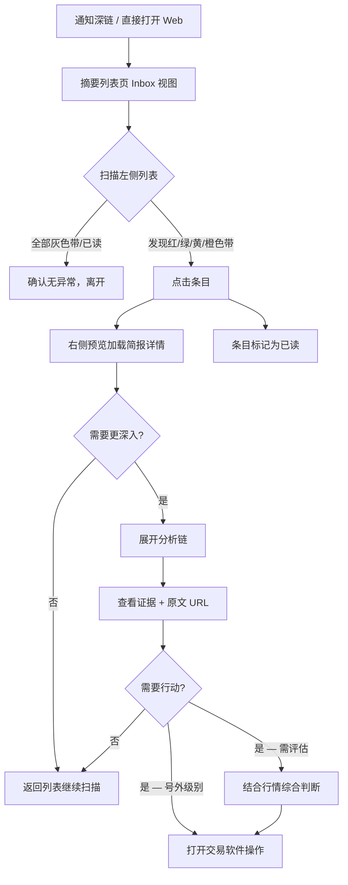
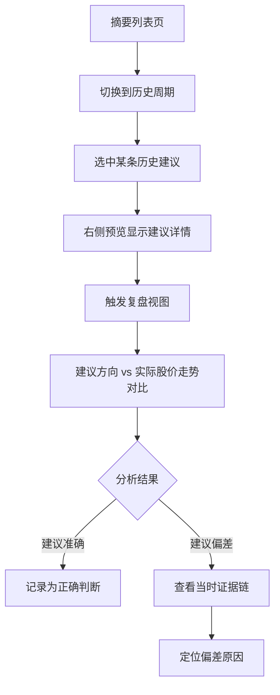
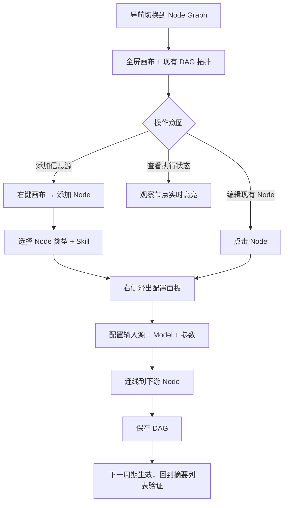
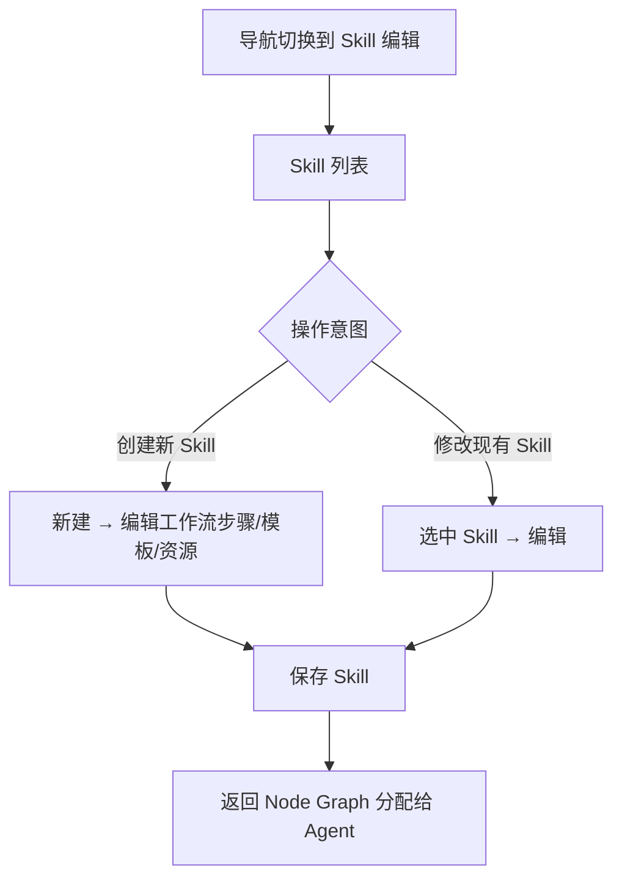

# UX Design Specification - stockImformation

**Author:** Yunxin
**Date:** 2026-04-09

---

<!-- UX design content will be appended sequentially through collaborative workflow steps -->

## Executive Summary

### Project Vision

stockImformation 是面向港股/A股个人交易者的信息分析与决策辅助系统。核心价值链「采集→分析→建议→推送」将交易者从分散的信息采集和人工分析中解放出来，在更短时间内获得可行动、可追溯、可复盘的判断依据。

UX 设计范围聚焦两个层面：
1. **Web 界面（主体）** — 三级信息架构（摘要→简报→分析链）、标的/信息源配置管理、历史复盘对比、Node Graph Agent 编排可视化
2. **通知文案（辅助）** — 16 字标题 + 摘要的文字结构规范

### Target Users

Yunxin — 个人交易者，持有港股/A股若干标的。技术背景深厚，Desktop 为主要使用场景。初期自用，后续可能开源。

核心使用场景：
- 日常简报消费：收到通知后 <5 秒完成「无异常」确认
- 异常评估：发现利空信号后 5-10 分钟内完成决策
- 号外快速行动：收到高优先级通知后立即操作
- 信息源配置：添加/调整标准源与非标准源
- 复盘调优：周末回顾建议准确性，调整参数
- 故障处理：采集异常时的恢复与上报

### Key Design Challenges

1. **三级渐进展开** — Web 界面核心交互模式：摘要列表→简报详情→完整分析链，每层信息密度需精确控制
2. **Node Graph 交互** — ComfyUI 风格的 DAG 编排界面：节点状态实时展示、连线数据流、侧边栏配置（Skills[] + Model + 输入源）
3. **配置管理体验** — 标的/信息源的 CRUD、非标准源的接入规则配置、信息源健康状态展示
4. **复盘与对比视图** — 历史建议 vs 实际股价变动的可视化对比

### Design Opportunities

1. **溯源链交互路径** — 从建议→分析→原文的可点击证据链，区别于传统金融产品
2. **降级状态透明化** — 采集失败、低置信度、矛盾信息等异常在 Web 界面中的视觉表达
3. **Node Graph 实时态势** — Agent 执行状态的实时可视化，兼顾运行时观察和事后回放

## Core User Experience

### Defining Experience

**核心动作：扫描→判断→深入（或离开）**

用户打开 Web 界面，首屏是当前周期的摘要列表。每个摘要条目对应一个标的，展示方向、置信度、核心原因。用户扫描列表后：
- 无异常 → 离开（<10 秒）
- 有异常 → 点击展开简报详情 → 必要时继续深入分析链查看证据

三级渐进展开是整个 Web 体验的核心交互模式。

### Platform Strategy

- **Desktop SPA** — React + TypeScript + Vite + shadcn/ui
- **交互方式** — 鼠标 + 键盘，键盘可完成核心浏览操作
- **实时性** — WebSocket 推送新结果，页面自动刷新
- **无需离线、无需 SEO**
- **Mobile** — 低优先级，日常依赖通知文案

### Effortless Interactions

- 摘要列表零配置首屏加载 — 打开即看到最新周期结果，无需选择标的或时间
- 三级展开原地渐进 — 不跳转页面，在当前上下文中逐层展开
- 溯源链一键可达 — 从建议直接点击到原文 URL
- 复盘从建议自然进入 — 在任意历史建议上触发复盘视图，无需切换到独立页面

### Critical Success Moments

1. **首屏扫描** — 用户在 10 秒内判断"今天有没有需要关注的"，这是最高频的成功时刻
2. **证据链验证** — 用户从建议追溯到原文，确认系统判断有据可依，建立信任
3. **Node Graph 首次配置** — 用户成功添加新信息源并在下一周期看到结果，验证系统可扩展

### Experience Principles

1. **信息密度优先** — 每一层展示恰好够判断的信息，不多不少
2. **渐进式复杂度** — 日常使用极简（摘要列表），运维场景才暴露复杂度（Node Graph）
3. **可追溯即可信** — 每条建议都有可点击的证据路径，系统透明度等于用户信任度
4. **异常先行** — 异常状态（低置信度、矛盾信息、采集失败）在摘要层即可感知，不需要深入才发现

### Page Structure

| 页面 | 定位 | 使用频率 |
|------|------|---------|
| 摘要列表（主页） | 日常信息消费入口 | 每日多次 |
| 简报详情（展开） | 单标的当期分析全貌 | 按需 |
| 分析链（展开） | 单条建议的完整证据 | 按需 |
| 复盘视图（从建议进入） | 历史建议 vs 实际走势 | 每周 |
| Node Graph | Agent 编排配置与运行状态 | 低频运维 |
| Skill 编辑 | Skill 工作流创建与管理 | 低频运维 |
| 信息源管理 | 标的/源 CRUD + 健康状态 | 低频运维 |

## Desired Emotional Response

### Primary Emotional Goals

1. **掌控感** — "我清楚知道市场发生了什么，没有遗漏"
2. **信任** — "系统的判断有据可依，我可以验证"
3. **效率感** — "5 分钟内完成了以前需要 1 小时的信息处理"

### Emotional Journey Mapping

| 阶段 | 期望情感 | 设计含义 |
|------|---------|---------|
| 首屏扫描 | 安心/警觉 | 无异常时视觉平静；有异常时异常条目醒目但不焦虑 |
| 展开简报 | 清晰 | 信息层次分明，每一层回答一个明确问题 |
| 查看证据链 | 确信 | 原文可点击，来源可验证，不留疑问 |
| 发现矛盾信息 | 审慎而非恐慌 | 矛盾标记清晰，双方证据并列展示 |
| 采集失败/降级 | 知情而非焦虑 | 明确标注哪些源失败，不隐瞒但不夸大 |
| Node Graph 配置 | 胜任 | 操作反馈即时，配置结果下周期可验证 |

### Emotions to Avoid

- **信息焦虑** — 数据堆砌导致"看了很多但不知道该怎么做"
- **虚假确定感** — 高置信度表达掩盖证据不足
- **系统不透明感** — 不知道系统在做什么、是否正常运行

### Design Implications

- 掌控感 → 首屏即全貌，异常先行展示，系统状态始终可见
- 信任 → 每条建议附带可点击证据链，低置信度/矛盾信息显式标记
- 效率感 → 渐进展开减少认知负荷，无异常时 <10 秒完成确认

## UX Pattern Analysis & Inspiration

### Inspiring Products Analysis

**ComfyUI（Node Graph）：**
- 节点即工作流单元，连线即数据流，所见即所得
- 拖拽式编排，零代码定义复杂流程
- 节点执行时实时高亮进度，执行结果直接在节点上预览
- 侧边栏配置不离开画布上下文

### Transferable UX Patterns

**Node Graph 页面（直接采用 ComfyUI 模式）：**
- 画布 + 节点 + 连线的核心交互
- 节点实时状态高亮（待执行/执行中/完成/失败）
- 右键菜单添加节点，侧边栏编辑节点配置
- 执行结果在节点上内联预览

**信息消费页面：**
- 折叠/展开列表 — 收件箱模式：列表扫描→选中展开→深入详情，不离开当前页面
- 状态色带 — 每个摘要条目左侧用色带标注方向/置信度（红=利空高置信、黄=矛盾/低置信、绿=利好高置信、灰=无变化）
- 元数据条 — 简报顶部固定展示采集状态（成功源/失败源/时间窗口），类似 CI/CD 构建状态栏
- 面包屑溯源 — 分析链中每一层都标注来源，可点击跳转原文

### Anti-Patterns to Avoid

- 信息瀑布流 — 无限滚动让用户失去全貌感，与"掌控感"目标冲突
- 多层页面跳转 — 摘要→简报→分析链每层新页面会导致上下文丢失
- 过度装饰的图表 — 数据可读性优先于视觉效果
- 隐藏系统状态 — 采集失败、降级等异常不能只在日志中体现

### Design Inspiration Strategy

**采用：**
- ComfyUI 的节点图交互模式 → Node Graph + Skill 编辑页面
- 收件箱式折叠列表 → 摘要列表页面
- CI/CD 状态栏 → 简报元数据区

**适配：**
- ComfyUI 的节点预览 → 适配为 Agent 执行状态（输入条目数/输出结果/耗时/错误）
- 色带状态指示 → 适配为金融场景的方向+置信度组合编码

**避免：**
- 瀑布流式信息展示
- 多页面跳转打断上下文

## Design System Foundation

### Design System Choice

shadcn/ui（架构文档已决策）

### Rationale

- 可主题化 + 代码所有权 — 组件源码直接复制到项目中，完全可控
- Tailwind CSS 原生 — 快速定制视觉样式
- Radix UI 底层 — 无障碍内置，键盘操作开箱支持
- 与 React + Vite 生态完全兼容
- 个人开发高效 — 组件质量高，减少自研成本

### Implementation Approach

- shadcn/ui CLI 按需添加组件（Button, Card, Table, Dialog, Sheet, Tabs 等）
- Node Graph 页面使用 @xyflow/react，与 shadcn/ui 组件混合使用
- 全局样式通过 Tailwind CSS 的 tailwind.config + CSS variables 统一管理

### Customization Strategy

- 色彩系统 — 基于 CSS variables 定义金融场景语义色（利好/利空/矛盾/中性/降级）
- 信息密度 — 调整默认间距为紧凑模式，适配数据密集型界面
- Node Graph 组件 — @xyflow/react 自定义节点内嵌 shadcn/ui 组件，保持视觉一致性

## Defining Core Experience

### Defining Experience

"扫一眼摘要，知道要不要行动"

用户打开 Web 界面 → 摘要列表呈现所有标的的当期状态 → 10 秒内完成判断。这是整个产品最高频、最关键的交互。

### User Mental Model

当前方式：用户需要打开多个网站（同花顺、雪球、交易所公告），逐个搜索标的相关信息，人工判断利好利空，自行形成交易决策。耗时长，信息分散，容易遗漏。

期望心智模型：系统已经完成了信息采集和分析，用户只需要"审阅结果" — 类似于审阅一份已整理好的简报，而非自己去搜集信息。

关键认知映射：
- 摘要列表 = "今天的市场速览"
- 色带 = "需不需要关注"
- 已读/未读标记 = "哪些我还没看过"
- 展开简报 = "到底发生了什么"
- 分析链 = "系统为什么这么判断"

### Success Criteria

1. 无异常场景 — 用户扫描摘要列表后 <10 秒确认"没有需要行动的"并离开
2. 有异常场景 — 用户从发现异常到完成决策判断 ≤5 分钟
3. 证据验证 — 用户从建议到原文 URL 不超过 3 次点击
4. 信息无遗漏感 — 已读/未读标记确保用户知道哪些条目尚未审阅，不会因为"怕漏了什么"而去其他平台复核

### Novel UX Patterns

组合模式 — 熟悉模式的金融场景适配：

- 收件箱式列表 + 语义色带 + 已读/未读标记 — 用户无需学习新交互，色带编码传达方向/置信度，已读状态传达审阅进度
- 渐进展开 + 溯源链 — 三级展开是常见模式，但每一层可追溯到原文证据是差异化设计
- 矛盾并列展示 — 信息矛盾时并列展示双方证据让用户自行判断

### Experience Mechanics

**1. Initiation（进入）：**
- 用户通过通知深链或直接打开 Web 界面
- 首屏即摘要列表，自动展示最新周期数据，无需操作
- 未读条目视觉突出，已读条目视觉弱化

**2. Interaction（交互）：**
- 扫描：逐条阅读摘要（标的 + 方向 + 核心原因 + 置信度），色带辅助快速定位
- 展开：点击摘要条目 → 原地展开简报详情（不跳转），条目标记为已读
- 深入：点击分析条目 → 原地展开分析链（证据→原文 URL）
- 复盘：在历史建议上触发复盘视图（建议 vs 实际走势）

**3. Feedback（反馈）：**
- 元数据条始终显示本周期的采集状态（成功/失败源 + 时间窗口）
- 低置信度/矛盾信息在摘要层即通过色带+标记可见
- 展开/收起有过渡动画，确认内容层级关系
- 已读/未读状态持久化，跨会话保持

**4. Completion（完成）：**
- 无异常 → 关闭页面，全程无需任何操作
- 有异常 → 查看完证据后，用户自行去交易软件操作（系统不执行交易）

## Visual Design Foundation

### Color System

暗色模式优先 — 金融信息工具典型使用场景是长时间盯屏，暗色模式减少视觉疲劳。

语义色（遵循中国股市惯例：红涨绿跌）：

| 语义 | 用途 | 色值方向 |
|------|------|---------|
| `--bullish` | 利好/买入/上涨 | 红色系 |
| `--bearish` | 利空/卖出/下跌 | 绿色系 |
| `--neutral` | 持有/无变化 | 灰色系 |
| `--conflict` | 矛盾信息/低置信度 | 琥珀/黄色系 |
| `--degraded` | 采集失败/系统降级 | 橙色系 |
| `--unread` | 未读条目 | 高对比前景色（亮白） |
| `--read` | 已读条目 | 降低不透明度 |

色带编码（摘要列表左侧 4px 色带）：
- 红色带 = 利好高置信
- 绿色带 = 利空高置信
- 黄色带 = 矛盾/低置信度
- 灰色带 = 无显著变化
- 橙色带 = 数据不完整（采集降级）

### Typography System

字体策略：
- 中文正文 — 系统默认字体（system-ui），中文渲染质量最优
- 英文/代码/数字 — 等宽字体（JetBrains Mono 或 Fira Code），股票代码、数值、时间戳需等宽对齐
- 整体调性 — 专业、克制、信息优先

字号层级（紧凑型）：

| 级别 | 用途 | 大小 |
|------|------|------|
| h1 | 页面标题 | 24px |
| h2 | 区域标题（标的名称） | 18px |
| h3 | 子标题（简报段落标题） | 16px |
| body | 正文/摘要内容 | 14px |
| caption | 元数据/时间/置信度 | 12px |

### Spacing & Layout Foundation

间距基准：4px（space-1），倍数递进：4/8/12/16/24/32

布局策略：
- 紧凑模式 — 信息密度优先，默认行间距 1.5，元素间距 8px
- 最大内容宽度 — 1200px（摘要列表/简报），Node Graph 页面全屏
- 侧边栏 — Node Graph 配置面板 320px 固定宽度

信息消费页面布局：
- 单栏布局，摘要条目上下堆叠
- 展开区域缩进或内嵌卡片，视觉上区分层级

Node Graph 页面布局：
- 全屏画布，无固定边距
- 侧边栏从右侧滑出覆盖

### Accessibility

- 色带不单独依赖颜色 — 同时配合图标或文字标签（如 ↑↓→ 或 买/卖/持有）
- 暗色模式下所有文字对比度 ≥ 4.5:1（WCAG AA）
- 键盘可完成摘要列表的上下导航和展开/收起操作

## Design Direction Decision

### Design Directions Explored

4 个设计方向（详见 ux-design-directions.html）：
- A Terminal — 最大信息密度，monospace 字体，终端美学
- B Dashboard — 卡片布局，视觉层次分明，更多留白
- C Inbox — 邮件客户端风格，左侧列表 + 右侧预览窗格
- D Feed — 时间线/信息流，垂直滚动，内联展开

### Chosen Direction

**Direction C: Inbox**

左侧为标的摘要列表（含色带、已读/未读标记），右侧为选中条目的预览窗格（简报详情→分析链渐进展开）。

### Design Rationale

- 列表+预览的双栏布局天然支持"扫描→深入"的核心交互模式
- 左侧列表保持全貌可见，用户始终知道还有哪些标的未查看
- 右侧预览窗格提供足够空间展示简报详情和分析链，无需反复展开/收起
- 已读/未读状态在列表中一目了然
- 与邮件客户端心智模型一致，用户零学习成本

### Implementation Approach

- 左侧列表固定宽度（~350px），右侧预览自适应填满
- 列表条目点击后右侧加载简报详情，条目标记为已读
- 预览窗格内部支持渐进展开（简报→分析链→原文溯源）
- 键盘支持：↑↓ 切换列表条目，Enter 展开分析链
- 元数据条置于预览窗格顶部

## User Journey Flows

### Journey 1: 日常简报消费（J1+J2 — 最高频）

关键交互细节：
- 进入即看到列表，未读条目高亮，已读条目弱化
- 点击条目 = 选中 + 标记已读 + 右侧加载详情（单步完成）
- 右侧预览内简报→分析链通过折叠区域渐进展开
- ↑↓ 键盘切换条目，Enter 展开分析链

### Journey 2: 复盘（J5 — 每周）

关键交互细节：
- 复盘视图在右侧预览窗格内展开，不离开 Inbox 布局
- 股价走势可内联小型图表（sparkline）
- 从历史建议直接进入，无需切换到独立页面

### Journey 3: Node Graph 配置（J4 — 低频运维）

### Journey 4: Skill 编辑（低频运维）

### Journey Patterns

跨旅程复用模式：

| 模式 | 适用旅程 | 交互规则 |
|------|---------|---------|
| 列表→详情（Inbox） | J1/J2/J5 | 左侧列表选中，右侧加载详情 |
| 渐进展开 | J1/J2/J5 | 折叠区域按需展开，不跳转 |
| 已读标记 | J1/J2 | 点击选中即标记，视觉弱化 |
| 侧边栏配置 | J3/J4 | 右侧滑出 Sheet，不离开画布 |
| 保存→验证 | J3/J4 | 配置变更下一周期生效，结果可在摘要列表验证 |

### Flow Optimization

- 日常消费路径最短化 — 无异常时 0 次点击即可完成判断（扫描列表色带）
- 异常路径渐进深入 — 每一步只暴露当前需要的信息量
- 运维与消费完全隔离 — 通过导航 Tab 分区，日常不接触 Node Graph/Skill 页面
- 所有配置变更都有可验证的反馈点（下一周期结果）

## Component Strategy

### Design System Components（shadcn/ui 直接可用）

| 组件 | 用途 |
|------|------|
| Tabs | 顶部导航 |
| Card | 简报详情区块、配置面板卡片 |
| Collapsible | 分析链渐进展开 |
| Sheet | Node Graph 右侧配置滑出面板 |
| Table | 信息源管理列表、审计记录 |
| Badge | 置信度标签、方向标签（买/卖/持有） |
| Button | 操作按钮 |
| Dialog | 确认操作弹窗 |
| Tooltip | 元数据悬停提示 |
| ScrollArea | 列表/预览窗格独立滚动 |
| Separator | 内容区域分隔 |

### Custom Components

**1. StockSummaryItem — 摘要条目**
- 用途：左侧列表中的单条标的摘要
- 构成：4px 色带 + 已读/未读状态 + 股票代码(monospace) + 名称 + 方向 Badge + 核心原因(单行截断) + 置信度
- 状态：unread(高亮) / read(弱化) / selected(蓝色边框) / hover(背景微亮)
- 交互：点击 = 选中 + 标记已读；↑↓ 键盘导航
- a11y：role="option", aria-selected, aria-label 包含完整摘要文本

**2. MetadataBar — 元数据条**
- 用途：预览窗格顶部，展示当前周期采集状态
- 构成：时间窗口 + 信息源状态（配置数/成功数/失败数 + 失败源名称） + 系统状态灯
- 状态：healthy(绿灯) / degraded(橙灯) / error(红灯)
- 交互：失败源名称可悬停查看失败原因

**3. EvidenceChain — 证据链**
- 用途：分析链中的单条证据
- 构成：来源标签 + 原文引用片段 + 原始 URL 链接 + 时间戳
- 状态：collapsed / expanded
- 交互：点击展开完整引用，URL 外链打开

**4. SignalStrip — 信号色带**
- 实现：CSS border-left，作为 StockSummaryItem 内置样式
- 颜色：bullish(红) / bearish(绿) / conflict(黄) / neutral(灰) / degraded(橙)

**5. ReviewPanel — 复盘面板**
- 用途：预览窗格内展示历史建议 vs 实际走势
- 构成：建议摘要 + sparkline 股价走势图 + 判断结果标记
- 依赖：轻量图表库（recharts Sparkline 或纯 SVG）

**6. NodeCard — DAG 节点卡片**
- 用途：@xyflow/react 自定义节点
- 构成：节点标题 + Skill 列表 + Model 标签 + 执行状态指示 + I/O 端口
- 状态：idle / running(脉冲动画) / completed(绿勾) / failed(红叉)
- 交互：单击选中弹出配置 Sheet，双击查看执行日志

### Implementation Roadmap

**Phase 1 — 摘要列表页（P2 首批）：**
StockSummaryItem, MetadataBar, EvidenceChain + shadcn Tabs/Badge/Collapsible/ScrollArea

**Phase 2 — Node Graph 页（P2 中期）：**
NodeCard(@xyflow/react 自定义节点) + shadcn Sheet/Dialog

**Phase 3 — 复盘 + Skill 编辑（P2 后期）：**
ReviewPanel + Skill 编辑器（复用 shadcn Card + 表单组件）

## UX Consistency Patterns

### Feedback Patterns

**信号反馈（金融语义）：**

| 信号 | 视觉表达 | 文字标签 |
|------|---------|---------|
| 利好高置信 | 红色带 + 红色 Badge | 买入 + 置信度百分比 |
| 利空高置信 | 绿色带 + 绿色 Badge | 卖出 + 置信度百分比 |
| 矛盾/低置信度 | 黄色带 + 黄色 Badge | 持有 + ⚠ 矛盾 或 低置信 |
| 无变化 | 灰色带 | 持有 + 无新增信息 |
| 数据降级 | 橙色带 + 橙色 Badge | 持有 + 数据不完整 |

**系统状态反馈：**
- 采集成功 → MetadataBar 绿色状态灯 + "5/7 源成功"
- 部分失败 → 橙色状态灯 + 失败源名称 hover 显示原因
- 全部失败 → 红色状态灯 + 内联告警条

**操作反馈（运维页面）：**
- 保存成功 → Toast 通知（shadcn Sonner），2 秒自动消失
- 保存失败 → Toast 错误通知，不自动消失，需手动关闭
- 配置变更 → 提示"下一采集周期生效"

### Navigation Patterns

顶层导航：Tabs 组件，4 个固定 Tab
- 摘要列表（默认激活）| Node Graph | Skill 编辑 | 信息源管理
- Tab 切换不刷新页面，组件保持状态

摘要列表内导航：
- 周期切换 — 顶部下拉或左右箭头切换历史周期
- 列表→预览 — 左侧点击，右侧响应（Inbox 模式）
- 预览内渐进 — Collapsible 折叠区域，层级缩进

深链支持：
- URL 格式：/summary/{cycle_id}/{stock_code}
- 通知推送携带深链，打开后自动定位到对应条目并选中

### Loading & Empty States

加载状态：
- 首屏加载 — Skeleton 占位，保持布局结构
- 预览加载 — 右侧窗格 Skeleton，左侧列表保持可操作
- Node Graph 加载 — 画布 Spinner + "加载 DAG 定义..."

空状态：
- 无摘要数据 — "当前周期暂无数据，系统正在采集中..."
- 无历史记录 — "暂无历史简报"
- Node Graph 空画布 — "右键添加第一个 Node"

### Error Patterns

错误层级：
1. 行内错误 — 表单字段下方红色文字（配置页面）
2. 区域错误 — Card 内告警条（如采集降级在 MetadataBar 展示）
3. 全局错误 — Toast 通知（如 WebSocket 断连）
4. 阻断错误 — Dialog 弹窗（如认证过期需重新登录）

错误恢复：
- WebSocket 断连 → 自动重连 + 顶部告警条"连接中断，正在重连..."
- API 请求失败 → Toast + 重试按钮
- 数据加载失败 → 空状态 + 手动刷新按钮

### Keyboard Patterns

| 快捷键 | 作用域 | 功能 |
|--------|--------|------|
| ↑ / ↓ | 摘要列表 | 切换选中条目 |
| Enter | 摘要列表 | 展开/收起分析链 |
| Esc | 全局 | 关闭 Sheet/Dialog/返回 |
| 1-4 | 全局 | 切换 Tab |

## Responsive Design & Accessibility

### Responsive Strategy

Desktop 优先，Mobile 最小化适配。

Desktop（主要）：
- Inbox 双栏布局：左侧列表 ~350px + 右侧预览自适应
- Node Graph 全屏画布
- 键盘快捷键完整支持

Tablet（有限适配）：
- Inbox 布局保持双栏，列表宽度压缩至 280px
- Node Graph 保持全屏，触控拖拽支持

Mobile（最低优先级）：
- Inbox 退化为单栏：列表全屏，点击条目全屏展示详情
- Node Graph 不适配移动端（提示"请使用桌面端"）
- 核心价值通过通知文案交付

### Breakpoint Strategy

| 断点 | 范围 | 布局变化 |
|------|------|---------|
| desktop | ≥1024px | Inbox 双栏，完整功能 |
| tablet | 768-1023px | 双栏压缩，触控优化 |
| mobile | <768px | 单栏堆叠，功能精简 |

Desktop-first 媒体查询（@media max-width）。

### Accessibility Strategy

目标：WCAG AA

- 色彩对比度 ≥ 4.5:1（暗色模式下所有文字）
- 色带不单独依赖颜色 — 配合文字标签和图标
- 键盘完整可操作
- ARIA 标注：列表 role="listbox"，条目 role="option"，预览 role="region"
- Focus visible 指示器（蓝色轮廓，2px）

### Testing Strategy

- 浏览器覆盖：Chrome / Firefox / Edge 最新两个主版本
- 键盘导航手动测试：Tab 顺序、快捷键、焦点管理
- 对比度验证：浏览器 DevTools Accessibility 面板
- 响应式验证：Chrome DevTools 设备模拟
